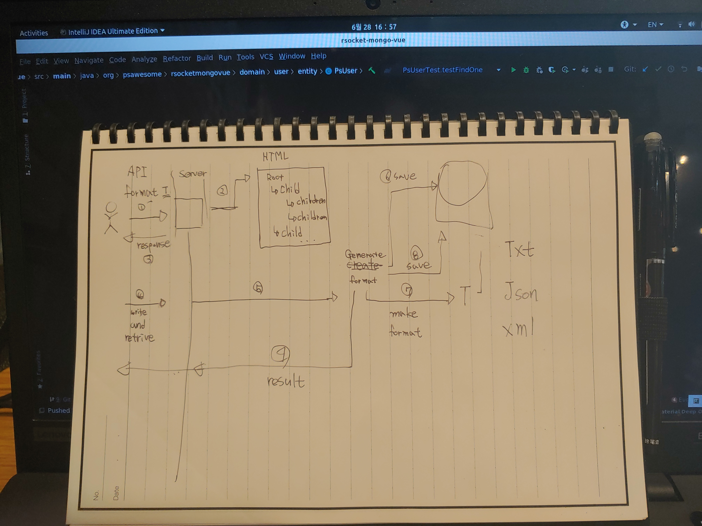

Create xml module
=

Todo
-

- [x] RDB 조회
    * [ ] DTO에 담기
    * [ ] 다음 상태로 이동
    
- [ ] XML Converter
    * [ ] K, V 형태 정의가 필요
    * [ ] data to element
    * [ ] add data to element
    * [ ] available array data to elements
    * [ ] available transform
        + [ ] file
        + [ ] text

EntityToDto
=

---

switchIfEmpty 

[참조 주소](https://github.com/wiv33/kotlin-webflux/blob/master/src/main/kotlin/com/psaweosme/kotlinwebflux/handler/TodoHandler.kt)
